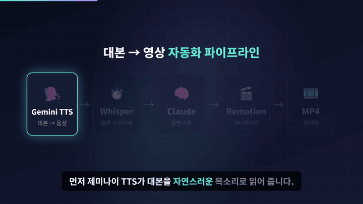
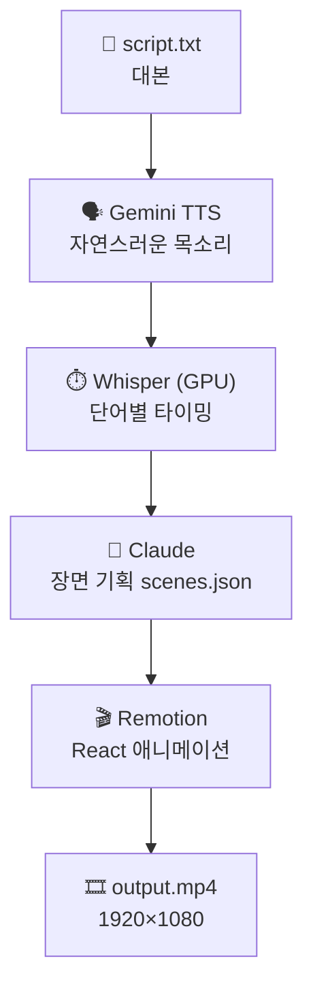
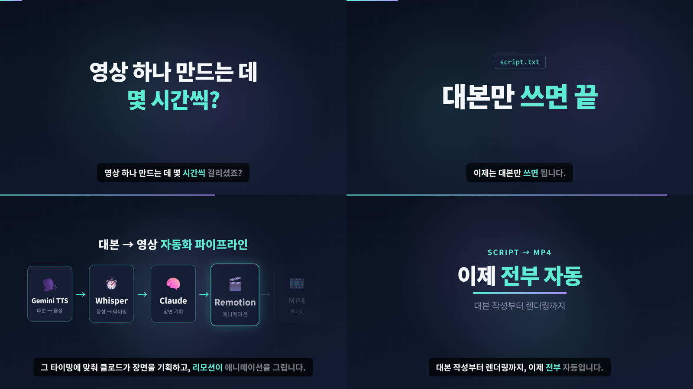

<div align="center">

# 🎬 claude-video-pipeline

### 대본만 쓰세요. 영상은 Claude가 만듭니다.

**대본 한 장 → 목소리 → 말에 딱 맞춰 움직이는 애니메이션 → 1080p MP4**
<br/>편집 프로그램 없이, 타임라인 없이, 키프레임 없이.



<sub>☝️ 이 영상은 대본 7줄로 만들었습니다. 음성 생성부터 렌더링까지 약 1분.</sub>

</div>

---

## 🤔 왜 만들었나

유튜브에서 자주 보이는 **"보이스오버 + 말에 맞춰 화면이 딱딱 바뀌는"** 설명 영상, 직접 만들어 보면 이렇습니다.

- 녹음하고 → 자막 따고 → 장면마다 타이밍 맞추고 → 애니메이션 넣고 → 다시 타이밍 맞추고…
- 30초짜리 하나에 **몇 시간**.

그런데 생각해 보면, 화면이 말과 딱 맞는 비결은 결국 **"몇 초에 무슨 말을 하는지"** 아는 것뿐이에요.
그건 기계가 훨씬 잘합니다. 그래서 전부 자동화했어요.

## ⚙️ 어떻게 동작하나



| 단계 | 하는 일 | 디테일 |
|---|---|---|
| 🗣️ **TTS** | 대본을 사람 같은 목소리로 | **무료 `gemini-3.8-flash-tts` 로 먼저** 만들고, 응답이 없거나 검증을 끝내 통과 못 하면 **그때만 유료 `gemini-2.5-pro-preview-tts` 로 전체 재합성** (비용 절약). 말투(`--style`)는 별도 필드로 지시해 **지시문을 소리 내 읽는 사고 방지**(무료 모델만 지원). 긴 대본은 단락 단위로 **나눠 합성**하고, 조각마다 목소리 높낮이(F0)를 재서 **다른 목소리로 나온 조각은 자동 재합성** |
| ⏱️ **타이밍** | 몇 초에 어떤 단어를 말하는지 | `faster-whisper large-v3` on CUDA. 받아쓴 글자는 버리고 **대본 원문에 글자 단위로 정렬** → 자막 오타 0 |
| 🛡️ **검증** | 음성이 대본과 다르면 멈춤 | TTS가 문장을 빼먹거나 **지어낸 말을 끼워 넣으면** 자동 감지 → 그 구간의 조각만 다시 합성(최대 3회). Whisper 환각("자막 제공 ○○○")도 자동으로 걸러냄 |
| 🔤 **발음** | 화면 표기 ≠ 읽는 말 | `M/M` 은 자막에 그대로, 음성은 "맨 먼스". 발음 사전 + 인라인 지정, 오독 의심 어절 자동 리포트 |
| 🧠 **기획** | 어떤 장면을 언제 보여줄지 | Claude가 `timing.json`을 읽고 `scenes.json` 작성. "**위스퍼**라고 말하는 순간 카드 등장" 같은 단어 단위 연출 |
| 🎬 **렌더** | 실제 영상 파일로 | Remotion. 장면 6종 + 말하는 단어를 따라가는 하이라이트 자막 + 진행 바 |

> 💡 **장면 타이밍을 "초"가 아니라 "단어"로 지정**하기 때문에, 목소리를 바꿔서 박자가 달라져도 화면이 알아서 말을 따라갑니다.

## 🖼️ 장면 미리보기



| type | 용도 | 연출 |
|---|---|---|
| `hook` | 도입 질문 | 큰 문장이 한 줄씩 떠오름 |
| `keyword` | 핵심 한 마디 | 키워드가 팝! |
| `steps` | 순서·흐름 | 말하는 순간 카드가 하나씩 켜지고 빛남 |
| `terminal` | 명령어·코드 | 타이핑 효과 |
| `bullets` | 나열·체크리스트 | 체크 표시와 함께 차례로 등장 |
| `title` | 챕터·마무리 | 제목 + 그라데이션 밑줄 |

자세한 작성법은 [`video/SCENES.md`](video/SCENES.md).

---

## 🚀 시작하기

### 준비물
- **Windows + NVIDIA GPU** (Whisper GPU 가속. 개발 환경: RTX 4080 SUPER)
- Python 3.10+ · Node.js 18+ · ffmpeg
- **Gemini API 키** — [Google AI Studio](https://aistudio.google.com/apikey)에서 무료 발급
- [Claude Code](https://claude.com/claude-code) (장면 기획 담당)

### 설치

```powershell
git clone https://github.com/jangGiraffe/claude-video-pipeline.git
cd claude-video-pipeline

# ffmpeg
winget install --id Gyan.FFmpeg -e

# Python (TTS + Whisper)
python -m venv .venv
.\.venv\Scripts\python.exe -m pip install -r requirements.txt

# Remotion
cd video; npm install; cd ..

# API 키 (사용자 환경변수에 저장)
[Environment]::SetEnvironmentVariable("GEMINI_API_KEY", "발급받은키", "User")

# (선택) 완성 영상 보관 폴더: 예시를 복사해 output_dir 을 내 환경에 맞게 수정
Copy-Item settings.example.json settings.local.json
```

`settings.local.json` 은 git 에서 제외됩니다. `output_dir` 을 정해 두면 렌더가 끝날 때 `work/<작업>/output.mp4` 를 `<output_dir>/<작업>.mp4` 로 복사해요 (환경변수 `VIDEO_OUTPUT_DIR` 가 있으면 그쪽이 우선).

## 🎯 사용법

### 방법 1. Claude Code에게 말하기 (추천)

이 레포에는 Claude Code 스킬 [`explainer-video`](.claude/skills/explainer-video/SKILL.md)가 들어 있어요. 폴더를 Claude Code로 열고 이렇게 말하면 됩니다.

> **"Claude Code 소개하는 1분짜리 영상 만들어줘"**

Claude가 알아서
1. 대본 쓰고 (보여 주고 OK 받고)
2. 음성 + 타이밍 뽑고
3. 장면 기획하고
4. **장면별 스크린샷을 직접 보고 깨진 곳을 고친 다음**
5. MP4로 렌더링해서 건네줍니다.

수정도 말로 하면 돼요.
> "두 번째 장면을 터미널로 바꿔줘" · "색을 드라큘라 테마로" · "좀 더 차분한 목소리로"

### 방법 2. 직접 실행

```powershell
# 1) work/my-video/script.txt 에 대본 작성 (한 줄에 한 문장)

# 2) 음성 + 타이밍 생성 (scenes.json 이 없으면 여기서 멈춤)
.\.venv\Scripts\python.exe pipeline\run.py my-video

# 3) work/my-video/scenes.json 작성 (예시: work/demo/scenes.json)

# 4) 장면별 미리보기 PNG → 확인
.\.venv\Scripts\python.exe pipeline\run.py my-video --from render --stills

# 5) 렌더링
.\.venv\Scripts\python.exe pipeline\run.py my-video --from render
```

| 옵션 | 설명 |
|---|---|
| `--no-paid` | 유료 모델로 넘어가지 않음 (무료로만 시도, 실패하면 멈춤) |
| `--model ...` | TTS 모델을 하나로 고정 (기본은 무료 → 실패 시 유료) |
| `--style "..."` | 말투 지시 (예: `"차분하고 따뜻한 다큐 내레이션"`). 무료 3.8 모델에서만 적용, 유료 Pro 에선 무시 |
| `--voice Kore` | 목소리 (Kore, Puck, Charon, Fenrir 등 30종, 또는 아래 보이스 디자인 별칭). 기본값은 `settings.local.json` 의 `voice` |
| `--from tts\|transcribe\|render` | 해당 단계부터 다시 실행 |
| `--stills` | MP4 대신 장면별 미리보기 PNG (요소가 차례로 켜지는 장면은 전부 켜진 모습도 한 장 더) |
| `--crf 23` | 화질/용량 (낮을수록 고화질·큰 파일). 기본 23 ≈ 3분에 25MB |

### 나만의 목소리 만들기 (보이스 디자인)

목소리를 문장으로 묘사하면 Gemini 가 그 목소리를 만들어 저장해 둡니다 (3.8 Flash TTS, 프로젝트당 200개, 마지막 사용 후 1년 보관).
매번 같은 목소리를 쓰니 영상마다·조각마다 톤이 흔들리는 문제가 줄어요.

```powershell
# 묘사는 한국어로 (영어로 쓰면 미리듣기가 영어로 나와요). 나이·성별·음색처럼 바뀌지 않는 특징만 1~2문장
.\.venv\Scripts\python.exe pipeline\voice_design.py narrator-ko "30대 여성 내레이터. 맑고 따뜻한 중간 톤으로 또박또박 차분하게 말한다."
# → voices.local.json 에 등록, 미리듣기 voices/narrator-ko.wav (둘 다 git 제외)

.\.venv\Scripts\python.exe pipeline\run.py my-video --voice narrator-ko
.\.venv\Scripts\python.exe pipeline\voice_design.py --list
```

### 대본 작성 팁

- **한 줄에 한 문장.** 빈 줄로 단락을 나누면 TTS가 단락 단위로 합성해요 (주제가 바뀌는 곳에서 나누면 톤 변화가 티 나지 않음).
- **발음 교정** — 화면엔 영어/기호 그대로 두고, 읽는 법만 바꿀 수 있어요.
  - 사전: `M/M = 맨 먼스` 처럼 한 줄씩. 뒤에 오는 파일이 앞을 덮어써요.
    | 파일 | 용도 | git |
    |---|---|---|
    | `pronounce.txt` | 공통 · 일반 용어 (M/M, PNR, SOAP …) | 커밋 |
    | `pronounce.local.txt` | 회사 · 대외비 용어 (제품명, 내부 시스템명 …) | **제외** |
    | `work/<job>/pronounce.txt` | 그 작업에서만 | 제외 |
  - 영문·숫자에 붙은 곳은 바꾸지 않고(`AU` 가 `AUTO` 안에서 안 바뀜), 한 어절에 여러 개면 모두 바꿔요(`D-6~D-0`).
    바로 뒤 조사(으로/로, 을/를, 이/가, 은/는, 과/와)는 발음에 맞게 자동 보정돼요.
  - 인라인(한 번만): `{M/M으로|맨 먼스로}` → 자막 `M/M으로`, 음성 `맨 먼스로`
  - 실행하면 **"발음 점검"** 에 대본과 다르게 들린 어절이 나와요. 숫자(다섯 → 5)처럼 표기 차이일 뿐인 것도 섞여 있으니, 진짜 오독만 사전에 추가하세요.

실시간으로 보고 싶으면 `cd video; npx remotion studio src/index.ts` 로 Remotion Studio를 띄우세요.

## 📁 구조

```
claude-video-pipeline/
├─ pipeline/
│  ├─ run.py          # 전체 파이프라인 (명령어 하나)
│  ├─ tts.py          # 대본 → Gemini TTS → voice.wav
│  ├─ transcribe.py   # voice.wav → Whisper → 대본 정렬 → timing.json / .srt
│  └─ common.py       # API 키, CUDA DLL, ffmpeg 경로, 대본 파싱(표기/발음 분리)
├─ video/             # Remotion 프로젝트
│  ├─ src/
│  │  ├─ Explainer.tsx   # 배경, 음성, 장면 배치, 자막
│  │  ├─ scenes.tsx      # 장면 컴포넌트 6종
│  │  ├─ Captions.tsx    # 단어 하이라이트 자막
│  │  └─ timing.tsx      # "단어 → 프레임" 변환
│  └─ SCENES.md       # 장면 기획서 작성 가이드
├─ pronounce.txt      # 공통 발음 사전 (표기 = 발음, 일반 용어)
├─ pronounce.local.txt  # 회사·대외비 발음 사전 (git 제외, 직접 만들기)
├─ work/<job>/        # 작업 폴더: script.txt (+pronounce.txt) → voice.wav, timing.json, scenes.json, output.mp4
├─ .claude/skills/explainer-video/   # Claude Code 스킬
└─ docs/
```

## 💸 비용

| 항목 | 비용 |
|---|---|
| Gemini TTS | 무료 모델로 먼저 시도 → 실패할 때만 유료(2.5 Pro, 결제 등록된 키 필요). 유료를 아예 막으려면 `--no-paid` |
| Whisper | 무료 (내 GPU) |
| Remotion | 개인·소규모 팀 무료 ([라이선스](https://www.remotion.dev/license)) |
| 렌더링 | 30초 영상 ≈ 30초 |

## 🩹 트러블슈팅

<details>
<summary><b>TypeError: open() got an unexpected keyword argument 'metadata_errors'</b></summary>

`av` 16 이상과 faster-whisper 1.2.x 가 호환되지 않아요. `pip install "av<16"` (requirements.txt에 반영됨)
</details>

<details>
<summary><b>"대본 시작 전에 다른 말이 있음" 경고</b></summary>

TTS가 말투 지시를 대본처럼 읽은 경우예요. `--style` 을 짧고 명확하게 바꿔서 다시 실행하세요.
(대본 첫 단어를 Whisper가 다르게 받아적은 것 — 예: JPASS → '제이패스' — 은 경고하지 않아요.)
</details>

<details>
<summary><b>중간에 남자/여자 목소리가 바뀜</b></summary>

같은 `--voice` 를 줘도 Gemini TTS는 호출마다 목소리 높낮이가 달라질 때가 있어요(특히 `--style` 을 줄 때 여성 Kore가 남성 음역까지 내려감). `tts.py` 가 조각마다 F0를 재서 중앙값에서 12% 넘게 벗어난 조각을 다시 합성해요. 출력의 `목소리 높낮이(Hz)` 줄에서 `*` 가 붙은 조각이 재합성 대상이에요. 끝까지 경고가 나면 `--style` 을 빼거나 톤만 짧게 지시하세요.
</details>

<details>
<summary><b>"중간에 대본에 없는 말이 연속으로 있음" 경고</b></summary>

TTS(LLM 기반)가 가끔 대본에 없는 문장을 지어내 끼워 넣어요. `run.py` 가 그 구간이 들어 있는 TTS 조각만 지우고 자동으로 다시 합성해요 (최대 3회, 나머지 조각은 `work/<job>/tts_cache/` 에서 재사용). 계속 실패하면 해당 단락을 더 짧게 나눠 보세요.
</details>

<details>
<summary><b>Whisper가 GPU를 못 찾음 / cublas DLL 오류</b></summary>

`common.py` 의 `setup_cuda_dlls()` 가 pip으로 설치한 `nvidia-*` 패키지의 DLL 경로를 등록해요. requirements.txt 대로 설치했는지 확인하세요.
</details>

## 🙏 영감

말에 맞춰 화면이 바뀌는 영상은 어떻게 만드는지 궁금해서 시작했어요. 조사한 내용은 [`docs/클로드_영상편집_정리.md`](docs/클로드_영상편집_정리.md)에 정리해 두었습니다.

---

<div align="center">

**Made with 🧠 Claude Code · 🗣️ Gemini TTS · ⏱️ Whisper · 🎬 Remotion**

</div>
